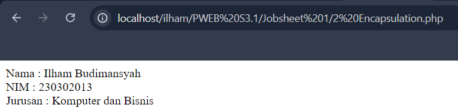
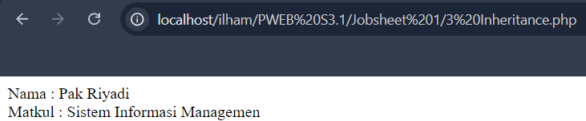
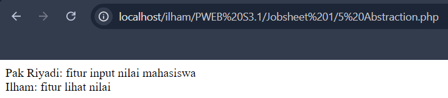

# DOKUMENTASI OOP JOBSHEET 2
Pemrograman berorientasi objek (Inggris: object-oriented programming disingkat OOP) merupakan paradigma pemrograman berdasarkan konsep "objek", yang dapat berisi data, dalam bentuk field atau dikenal juga sebagai atribut; serta kode, dalam bentuk fungsi/prosedur atau dikenal juga sebagai method. Semua data dan fungsi di dalam paradigma ini dibungkus dalam kelas-kelas atau objek-objek. Bandingkan dengan logika pemrograman terstruktur. Setiap objek dapat menerima pesan, memproses data, dan mengirim pesan ke objek lainnya

## Class and Object
```php
<?php
// Definisi Class Mahasiswa
// Membuat kelas Mahasiswa yang merepresentasikan entitas mahasiswa
class Mahasiswa 
{
    // Atribut atau Properties
    // Atribut ini bersifat public sehingga dapat diakses dari luar kelas
    public $nama;    // Properti yang menyimpan nama mahasiswa
    public $nim;     // Properti yang menyimpan nomor induk mahasiswa (NIM)
    public $jurusan; // Properti yang menyimpan jurusan mahasiswa

    // Constructor
    // Constructor ini digunakan untuk menginisialisasi objek dengan nilai awal untuk nama, nim, dan jurusan
    public function __construct($nama, $nim, $jurusan)
    {
        // Mengatur nilai properti berdasarkan parameter yang diterima
        $this->nama = $nama;       // Inisialisasi properti $nama dengan nilai parameter $nama
        $this->nim = $nim;         // Inisialisasi properti $nim dengan nilai parameter $nim
        $this->jurusan = $jurusan; // Inisialisasi properti $jurusan dengan nilai parameter $jurusan
    }

    // Metode atau Function
    // Metode ini menampilkan data mahasiswa dalam bentuk string
    public function tampilkanData()
    {
        // Mengembalikan string yang berisi informasi nama, nim, dan jurusan mahasiswa
        return "Nama : $this->nama <br> NIM : $this->nim <br> Jurusan : $this->jurusan";
    }
}

// Instansiasi Objek
// Membuat objek baru dari kelas Mahasiswa dan memberikan nilai awal untuk nama, nim, dan jurusan
$mhs1 = new Mahasiswa("Ilham Budimansyah", "230302013", "Komputer dan Bisnis");

// Memanggil metode tampilkanData untuk menampilkan data mahasiswa dan mencetaknya ke layar
echo $mhs1->tampilkanData();
?>
```

## Encapsulation
```php
<?php
// Mendefinisikan kelas Mahasiswa
class Mahasiswa 
{
    // Properti bersifat private sehingga hanya dapat diakses dari dalam kelas
    private $nama;      // Properti untuk menyimpan nama mahasiswa, aksesnya dibatasi hanya dalam kelas ini
    private $nim;       // Properti untuk menyimpan NIM mahasiswa, aksesnya dibatasi hanya dalam kelas ini
    private $jurusan;   // Properti untuk menyimpan jurusan mahasiswa, aksesnya dibatasi hanya dalam kelas ini

    // Konstruktor kelas yang digunakan untuk menginisialisasi properti ketika objek dibuat
    public function __construct($nama, $nim, $jurusan)
    {
        // Menginisialisasi properti nama, nim, dan jurusan dengan nilai yang diberikan saat objek dibuat
        $this->nama = $nama;          // Mengatur properti $nama dengan nilai yang diterima dari parameter $nama
        $this->nim = $nim;            // Mengatur properti $nim dengan nilai yang diterima dari parameter $nim
        $this->jurusan = $jurusan;    // Mengatur properti $jurusan dengan nilai yang diterima dari parameter $jurusan
    }

    // Getter untuk properti nama, mengembalikan nilai nama yang diawali dengan teks "Nama : "
    public function getNama()
    {
        return "Nama : " . $this->nama;   // Mengembalikan teks yang berisi nama mahasiswa
    }

    // Getter untuk properti nim, mengembalikan nilai nim yang diawali dengan teks "NIM : "
    public function getNim()
    {
        return "NIM : " . $this->nim;     // Mengembalikan teks yang berisi NIM mahasiswa
    }

    // Getter untuk properti jurusan, mengembalikan nilai jurusan yang diawali dengan teks "Jurusan : "
    public function getJurusan()
    {
        return "Jurusan : " . $this->jurusan; // Mengembalikan teks yang berisi jurusan mahasiswa
    }

    // Setter untuk mengubah nilai properti nama
    public function setNama($nama)
    {
        $this->nama = $nama;  // Mengatur properti $nama dengan nilai baru yang diterima dari parameter $nama
    }

    // Setter untuk mengubah nilai properti nim
    public function setNim($nim)
    {
        $this->nim = $nim;    // Mengatur properti $nim dengan nilai baru yang diterima dari parameter $nim
    }

    // Setter untuk mengubah nilai properti jurusan
    public function setJurusan($jurusan)
    {
        $this->jurusan = $jurusan;  // Mengatur properti $jurusan dengan nilai baru yang diterima dari parameter $jurusan
    }
}

// Membuat objek baru dari kelas Mahasiswa dengan nilai awal untuk nama, nim, dan jurusan
$mhs1 = new Mahasiswa("Ilham Budimansyah", "230302013", "Komputer dan Bisnis");

// Menampilkan nama mahasiswa dengan memanggil metode getNama()
echo $mhs1->getNama(). "<br>";

// Menampilkan nim mahasiswa dengan memanggil metode getNim()
echo $mhs1->getNim(). "<br>";

// Menampilkan jurusan mahasiswa dengan memanggil metode getJurusan()
echo $mhs1->getJurusan();
?>
```


## Inheritance
```php
<?php

// Definisi Kelas Pengguna
// Membuat kelas Pengguna yang merepresentasikan entitas dasar pengguna
class Pengguna 
{
    // Atribut protected, hanya bisa diakses oleh kelas ini dan kelas turunannya
    protected $nama; // Properti yang menyimpan nama pengguna

    // Konstruktor
    // Konstruktor ini digunakan untuk menginisialisasi atribut nama
    public function __construct($nama)
    {
        $this->nama = $nama; // Inisialisasi properti $nama dengan nilai parameter $nama
    }
    
    // Metode protected untuk mengambil nilai nama
    // Hanya bisa diakses dari dalam kelas ini atau dari kelas turunan
    protected function getNama() 
    {
        return $this->nama; // Mengembalikan nilai properti $nama
    }
}

// Definisi Kelas Dosen yang merupakan turunan dari kelas Pengguna
// Kelas Dosen mewarisi properti dan metode dari kelas Pengguna
class Dosen extends Pengguna
{
    // Atribut private, hanya bisa diakses oleh kelas ini
    private $matkul; // Properti yang menyimpan mata kuliah yang diampu oleh dosen

    // Konstruktor
    // Konstruktor ini digunakan untuk menginisialisasi atribut nama dan matkul
    public function __construct($nama, $matkul)
    {
        // Mengatur nilai atribut matkul
        $this->matkul = $matkul; // Inisialisasi properti $matkul dengan nilai parameter $matkul

        // Mengatur nilai atribut nama dengan memanggil konstruktor kelas induk
        parent::__construct($nama); // Memanggil konstruktor kelas induk (Pengguna) untuk mengatur nilai $nama
    }

    // Metode public untuk menampilkan informasi dosen
    public function getDosen()
    {
        // Mengembalikan string yang berisi nama dosen dan mata kuliah yang diampu
        return "Nama : " . $this->getNama() . "<br> Matkul : " . $this->matkul;
        // Menggunakan metode getNama() dari kelas Pengguna untuk mengambil nilai $nama
    }
}

// Instansiasi objek dari kelas Dosen
// Objek ini mewakili seorang dosen dengan nama "Pak Riyadi" dan mata kuliah "Sistem Informasi Managemen"
$dosen = new Dosen("Pak Riyadi", "Sistem Informasi Managemen");

// Memanggil metode getDosen untuk menampilkan informasi dosen
echo $dosen->getDosen(); // Menampilkan informasi dosen ke layar
?>
```



## Polymorphism
```php

<?php

// Definisi Kelas Pengguna
// Membuat kelas Pengguna yang merepresentasikan entitas umum dari pengguna
class Pengguna
{
    // Atribut protected, hanya dapat diakses oleh kelas ini dan kelas turunan
    protected $nama; // Properti yang menyimpan nama pengguna

    // Konstruktor untuk menginisialisasi atribut nama
    public function __construct($nama)
    {
        $this->nama = $nama; // Inisialisasi properti $nama dengan nilai parameter $nama
    }

    // Metode untuk mendapatkan nilai nama
    public function getNama()
    {
        return $this->nama; // Mengembalikan nilai properti $nama
    }

    // Metode untuk mengakses fitur, dapat di-overridden oleh kelas turunan
    public function aksesFitur()
    {
        return "Mengakses Fitur"; // Mengembalikan string default untuk akses fitur
    }
}

// Definisi Kelas Dosen yang merupakan turunan dari kelas Pengguna
// Kelas Dosen mewarisi properti dan metode dari kelas Pengguna
class Dosen extends Pengguna
{
    // Atribut private, hanya dapat diakses oleh kelas ini
    private $matkul; // Properti yang menyimpan mata kuliah yang diampu oleh dosen

    // Konstruktor untuk menginisialisasi atribut matkul dan nama
    // Konstruktor kelas induk dipanggil dengan parent::__construct($nama)
    public function __construct($nama, $matkul)
    {
        // Memanggil konstruktor kelas induk untuk menginisialisasi atribut nama
        parent::__construct($nama); // Mengatur nilai atribut $nama dengan memanggil konstruktor kelas induk (Pengguna)
        // Menginisialisasi atribut matkul
        $this->matkul = $matkul; // Inisialisasi properti $matkul dengan nilai parameter $matkul
    }

    // Override metode aksesFitur untuk memberikan fungsionalitas khusus bagi Dosen
    public function aksesFitur()
    {
        return "Edit Nilai"; // Mengembalikan string khusus untuk akses fitur dosen
    }

    // Metode untuk mendapatkan informasi dosen, termasuk nama dan mata kuliah yang diampu
    public function getDosen()
    {
        return "<br>Nama : " . $this->getNama() . "<br> Matkul : " . $this->matkul; 
        // Mengembalikan string yang berisi nama dosen dan mata kuliah yang diampu
        // Menggunakan metode getNama() untuk mendapatkan nilai $nama dari kelas induk
    }
}

// Definisi Kelas Mahasiswa yang merupakan turunan dari kelas Pengguna
// Kelas Mahasiswa mewarisi properti dan metode dari kelas Pengguna
class Mahasiswa extends Pengguna
{
    // Konstruktor untuk menginisialisasi atribut nama
    // Konstruktor kelas induk dipanggil dengan parent::__construct($nama)
    public function __construct($nama)
    {
        // Memanggil konstruktor kelas induk untuk menginisialisasi atribut nama
        parent::__construct($nama); // Mengatur nilai atribut $nama dengan memanggil konstruktor kelas induk (Pengguna)
    }

    // Override metode aksesFitur untuk memberikan fungsionalitas khusus bagi Mahasiswa
    public function aksesFitur()
    {
        return "Lihat Nilai"; // Mengembalikan string khusus untuk akses fitur mahasiswa
    }
}

// Instansiasi objek dari kelas Dosen
$dosen = new Dosen("Pak Riyadi", "Sistem Informasi Managemen");
// Objek ini mewakili seorang dosen dengan nama "Pak Riyadi" dan mata kuliah "Sistem Informasi Managemen"

// Memanggil metode aksesFitur untuk objek dosen dan mencetak hasilnya
echo "Fitur Dosen : " . $dosen->aksesFitur();
// Menampilkan fitur yang bisa diakses oleh dosen, yaitu "Edit Nilai"

// Instansiasi objek dari kelas Mahasiswa
$mhs = new Mahasiswa("Ilham");
// Objek ini mewakili seorang mahasiswa dengan nama "Ilham"

// Memanggil metode aksesFitur untuk objek mahasiswa dan mencetak hasilnya
echo "<br>Fitur Mahasiswa : " . $mhs->aksesFitur();
// Menampilkan fitur yang bisa diakses oleh mahasiswa, yaitu "Lihat Nilai"

// Memanggil metode getDosen untuk mendapatkan informasi dosen dan mencetak hasilnya
echo $dosen->getDosen();
// Menampilkan informasi dosen termasuk nama dan mata kuliah yang diampu
?>
```


## Abstraction
```php
<?php
// Definisi Class
// Kelas Pengguna adalah kelas abstrak yang tidak dapat diinstansiasi secara langsung
// Kelas ini menyediakan metode dan properti umum untuk kelas-kelas turunannya
abstract class Pengguna
{
    // Atribut atau Properties
    // Properti protected dapat diakses dari kelas ini dan kelas turunannya
    protected $nama; // Menyimpan nama pengguna

    // Constructor
    // Konstruktor ini kosong, tetapi tetap didefinisikan untuk memungkinkan inisialisasi di masa depan
    public function __construct()
    {
        // Kosong, tetapi bisa diisi jika diperlukan untuk ekspansi di masa depan
    }

    // Metode atau Function
    // Metode ini digunakan untuk menetapkan nilai properti nama
    public function setNama($nama)
    {
        $this->nama = $nama; // Mengatur nilai properti $nama
    }

    // Metode atau Function    
    // Metode ini digunakan untuk mengambil nilai properti nama
    public function getNama()
    {
        return $this->nama; // Mengembalikan nilai properti $nama
    }

    // Deklarasi metode abstrak
    // Metode ini wajib diimplementasikan oleh kelas turunan
    abstract public function aksesFitur();
}

// Definisi Class Dosen yang merupakan turunan dari kelas Pengguna
// Kelas ini mewarisi semua properti dan metode dari kelas Pengguna
class Dosen extends Pengguna
{
    // Constructor
    // Memanggil konstruktor kelas induk, meskipun kosong, untuk menjaga kemungkinan ekspansi di masa depan
    public function __construct()
    {
        parent::__construct(); // Memanggil konstruktor kelas induk (Pengguna)
    }

    // Implementasi metode abstrak aksesFitur
    // Menampilkan nama dosen dan fitur yang dapat diakses oleh dosen
    public function aksesFitur()
    {
        echo $this->getNama() . ": fitur input nilai mahasiswa <br>"; // Menampilkan informasi fitur yang dapat diakses oleh dosen
    }
}

// Definisi Class Mahasiswa yang merupakan turunan dari kelas Pengguna
// Kelas ini mewarisi semua properti dan metode dari kelas Pengguna
class Mahasiswa extends Pengguna
{
    // Constructor
    // Memanggil konstruktor kelas induk, meskipun kosong, untuk menjaga kemungkinan ekspansi di masa depan
    public function __construct()
    {
        parent::__construct(); // Memanggil konstruktor kelas induk (Pengguna)
    }

    // Implementasi metode abstrak aksesFitur
    // Menampilkan nama mahasiswa dan fitur yang dapat diakses oleh mahasiswa
    public function aksesFitur()
    {
        echo $this->getNama() . ": fitur lihat nilai <br>"; // Menampilkan informasi fitur yang dapat diakses oleh mahasiswa
    }
}

// Pembuatan objek dari kelas Dosen
$dosen = new Dosen(); // Membuat objek baru dari kelas Dosen

// Menetapkan nama untuk objek dosen
$dosen->setNama("Pak Riyadi"); // Mengatur nama dosen

// Pembuatan objek dari kelas Mahasiswa
$mhs = new Mahasiswa(); // Membuat objek baru dari kelas Mahasiswa

// Menetapkan nama untuk objek mahasiswa
$mhs->setNama("Ilham"); // Mengatur nama mahasiswa

// Memanggil metode aksesFitur pada objek dosen
$dosen->aksesFitur(); // Menampilkan fitur yang dapat diakses oleh dosen

// Memanggil metode aksesFitur pada objek mahasiswa
$mhs->aksesFitur(); // Menampilkan fitur yang dapat diakses oleh mahasiswa
?>
```


