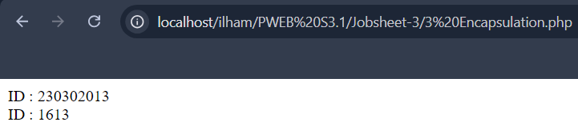

# DOKUMENTASI OOP JOBSHEET 3
Pemrograman berorientasi objek (Inggris: object-oriented programming disingkat OOP) merupakan paradigma pemrograman berdasarkan konsep "objek", yang dapat berisi data, dalam bentuk field atau dikenal juga sebagai atribut; serta kode, dalam bentuk fungsi/prosedur atau dikenal juga sebagai method. Semua data dan fungsi di dalam paradigma ini dibungkus dalam kelas-kelas atau objek-objek. Bandingkan dengan logika pemrograman terstruktur. Setiap objek dapat menerima pesan, memproses data, dan mengirim pesan ke objek lainnya

## Inheritance

```php
<?php

// Mendefinisikan kelas Person
class Person
{
    // Properti yang dilindungi (hanya dapat diakses oleh kelas ini dan kelas turunannya)
    protected $name;

    // Metode yang dilindungi untuk mengembalikan nilai properti $name
    protected function getName()
    {
        return $this->name;
    }
}

// Mendefinisikan kelas Student yang merupakan turunan dari kelas Person
class Student extends Person
{
    // Properti publik yang dapat diakses dari luar kelas
    public $studentID;

    // Metode publik untuk mengembalikan nilai properti $studentID
    public function getStudentId()
    {
        return $this->studentID;
    }
}

// Membuat instance baru dari kelas Student
$murid = new Student();

// Menetapkan nilai '1613' ke properti studentID
$murid->studentID = "1613";

// Menampilkan nilai dari properti studentID dengan memanggil metode getStudentId
echo $murid->getStudentId();
?>
```


## Polymorphism

```php
<?php

// Mendefinisikan kelas Person
class Person
{
    // Properti yang dilindungi, hanya dapat diakses di dalam kelas ini dan kelas turunannya
    protected $name;

    // Konstruktor kelas Person untuk menetapkan nilai properti $name
    public function __construct($name)
    {
        $this->name = $name;
    }

    // Metode dilindungi untuk mengembalikan nilai dari properti $name
    protected function getName()
    {
        return $this->name;
    }
}

// Mendefinisikan kelas Student sebagai turunan dari kelas Person
class Student extends Person
{
    // Properti publik yang dapat diakses dari luar kelas
    public $studentID;

    // Konstruktor kelas Student untuk menetapkan nilai properti $name dan $studentID
    public function __construct($name, $studentID)
    {
        // Memanggil konstruktor parent (kelas induk) untuk menetapkan nilai $name
        parent::__construct($name);
        // Menetapkan nilai $studentID
        $this->studentID = $studentID;
    }

    // Metode publik untuk mengembalikan nilai properti $studentID
    public function getStudentId()
    {
        return $this->studentID;
    }

    // Metode publik untuk mengembalikan nama yang diubah dengan prefix "Student : "
    public function getName()
    {
        return "Student : " . $this->name;
    }
}

// Mendefinisikan kelas Teacher sebagai turunan dari kelas Person
class Teacher extends Person
{
    // Properti privat yang hanya dapat diakses di dalam kelas ini saja
    private $teacherID;

    // Konstruktor kelas Teacher untuk menetapkan nilai properti $name dan $teacherID
    public function __construct($name, $teacherID)
    {
        // Memanggil konstruktor parent (kelas induk) untuk menetapkan nilai $name
        parent::__construct($name);
        // Menetapkan nilai $teacherID
        $this->teacherID = $teacherID;
    }

    // Metode publik untuk mengembalikan nama yang diubah dengan prefix "Teacher : "
    public function getName()
    {
        return "Teacher : " . $this->name;
    }
}

// Membuat instance baru dari kelas Student
$murid = new Student("Roxas", "1613");
// Menampilkan nama dengan prefix "Student : "
echo $murid->getName();

echo "<br>";

// Membuat instance baru dari kelas Teacher
$dosen = new Teacher("Xehanort", "0101");
// Menampilkan nama dengan prefix "Teacher : "
echo $dosen->getName();
?>
```


## Encapsulation

```php
<?php

// Mendefinisikan kelas Person
class Person
{
    // Properti yang dilindungi, hanya dapat diakses di dalam kelas ini dan kelas turunannya
    protected $name;

    // Konstruktor kelas Person untuk menetapkan nilai properti $name
    public function __construct($name)
    {
        $this->name = $name;
    }

    // Metode dilindungi untuk mengembalikan nilai dari properti $name
    protected function getName()
    {
        return $this->name;
    }
}

// Mendefinisikan kelas Student sebagai turunan dari kelas Person
class Student extends Person
{
    // Properti privat yang hanya dapat diakses di dalam kelas ini saja
    private $studentID;

    // Konstruktor kelas Student untuk menetapkan nilai properti $name dan $studentID
    public function __construct($name, $studentID)
    {
        // Memanggil konstruktor parent (kelas induk) untuk menetapkan nilai $name
        parent::__construct($name);
        // Menetapkan nilai $studentID
        $this->studentID = $studentID;
    }

    // Metode publik untuk mengembalikan nilai dari properti $studentID
    public function getStudentId()
    {
        return $this->studentID;
    }

    // Metode publik untuk menetapkan nilai properti $studentID
    public function setStudentId($id)
    {
        $this->studentID = $id;
    }

    // Metode publik untuk mengembalikan nama yang diubah dengan prefix "Student : "
    public function getName()
    {
        return "Student : " . $this->name;
    }
}

// Mendefinisikan kelas Teacher sebagai turunan dari kelas Person
class Teacher extends Person
{
    // Properti privat yang hanya dapat diakses di dalam kelas ini saja
    private $teacherID;

    // Konstruktor kelas Teacher untuk menetapkan nilai properti $name dan $teacherID
    public function __construct($name, $teacherID)
    {
        // Memanggil konstruktor parent (kelas induk) untuk menetapkan nilai $name
        parent::__construct($name);
        // Menetapkan nilai $teacherID
        $this->teacherID = $teacherID;
    }

    // Metode publik untuk mengembalikan nama yang diubah dengan prefix "Teacher : "
    public function getName()
    {
        return "Teacher : " . $this->name;
    }
}

// Membuat instance baru dari kelas Student
$mhs = new Student("Roxas", "230302013");

// Menampilkan ID siswa menggunakan metode getStudentId
echo "ID : " . $mhs->getStudentId();

// Mengubah ID siswa dengan metode setStudentId
$mhs->setStudentId("1613");

// Menampilkan ID siswa yang baru setelah diubah
echo "<br> ID : " . $mhs->getStudentId();
?>
```



## Abstraction

```php
<?php

// Mendefinisikan kelas abstrak Course
abstract class Course
{
    // Mendeklarasikan metode abstrak yang harus diimplementasikan oleh kelas turunannya
    abstract public function getCourseDetails();
}

// Mendefinisikan kelas OnlineCourse sebagai turunan dari kelas Course
class OnlineCourse extends Course
{
    // Properti privat yang hanya dapat diakses di dalam kelas ini saja
    private $courseName;
    private $platform;

    // Konstruktor untuk menginisialisasi nilai properti $courseName dan $platform
    public function __construct($courseName, $platform)
    {
        $this->courseName = $courseName;
        $this->platform = $platform;
    }

    // Mengimplementasikan metode abstrak dari kelas Course
    public function getCourseDetails()
    {
        return "Online Course : " . $this->courseName . ", Platform : " . $this->platform;
    }
}

// Mendefinisikan kelas OfflineCourse sebagai turunan dari kelas Course
class OfflineCourse extends Course
{
    // Properti privat yang hanya dapat diakses di dalam kelas ini saja
    private $courseName;
    private $location;

    // Konstruktor untuk menginisialisasi nilai properti $courseName dan $location
    public function __construct($courseName, $location)
    {
        $this->courseName = $courseName;
        $this->location = $location;
    }

    // Mengimplementasikan metode abstrak dari kelas Course
    public function getCourseDetails()
    {
        return "Offline Course : " . $this->courseName . ", Location : " . $this->location;
    }
}

// Membuat instance baru dari kelas OnlineCourse
$online = new OnlineCourse("Bahasa Inggris", "Zoom");
// Memanggil metode getCourseDetails dan menyimpan hasilnya ke variabel $data_online
$data_online = $online->getCourseDetails();
// Menampilkan detail kursus online
echo $data_online;

echo "<br>";

// Membuat instance baru dari kelas OfflineCourse
$offline = new OfflineCourse("Bahasa Inggris Grammar", "Cilacap");
// Menampilkan detail kursus offline
echo $offline->getCourseDetails();
?>
```


## Tugas
```php
<?php

// Mendefinisikan kelas abstrak Person
abstract class Person
{
    // Properti yang dilindungi, hanya dapat diakses di dalam kelas ini dan kelas turunannya
    protected $name;
    protected $address;

    // Konstruktor untuk menginisialisasi properti $name dan $address
    public function __construct($name, $address)
    {
        $this->name = $name;
        $this->address = $address;
    }

    // Metode publik untuk mendapatkan nilai dari properti $name
    public function getName()
    {
        return $this->name;
    }

    // Metode publik untuk mendapatkan nilai dari properti $address
    public function getAddress()
    {
        return $this->address;
    }

    // Mendeklarasikan metode abstrak yang harus diimplementasikan oleh kelas turunannya
    abstract public function getRole();
}

// Mendefinisikan kelas Lecturer sebagai turunan dari kelas Person
class Lecturer extends Person
{
    // Properti privat untuk menyimpan NIDN dosen
    private $NIDN;

    // Konstruktor untuk menginisialisasi properti $name, $address, dan $NIDN
    public function __construct($name, $address, $NIDN)
    {
        // Memanggil konstruktor kelas induk untuk mengatur nilai $name dan $address
        parent::__construct($name, $address);
        $this->NIDN = $NIDN;
    }

    // Metode publik untuk mendapatkan nilai dari properti $NIDN
    public function getNIDN()
    {
        return $this->NIDN;
    }

    // Mengimplementasikan metode abstrak getRole dari kelas Person
    public function getRole()
    {
        return "Lecturer:";
    }
}

// Mendefinisikan kelas Student sebagai turunan dari kelas Person
class Student extends Person
{
    // Properti privat untuk menyimpan NIM mahasiswa
    private $NIM;

    // Konstruktor untuk menginisialisasi properti $name, $address, dan $NIM
    public function __construct($name, $address, $NIM)
    {
        // Memanggil konstruktor kelas induk untuk mengatur nilai $name dan $address
        parent::__construct($name, $address);
        $this->NIM = $NIM;
    }

    // Metode publik untuk mendapatkan nilai dari properti $NIM
    public function getNIM()
    {
        return $this->NIM;
    }

    // Mengimplementasikan metode abstrak getRole dari kelas Person
    public function getRole()
    {
        return "Student :";
    }
}

// Mendefinisikan kelas abstrak Journal
abstract class Journal
{
    // Properti yang dilindungi untuk menyimpan judul dan penulis jurnal
    protected $title;
    protected $writer;

    // Konstruktor untuk menginisialisasi properti $title dan $writer
    public function __construct($title, $writer)
    {
        $this->title = $title;
        $this->writer = $writer;
    }

    // Mendeklarasikan metode abstrak yang harus diimplementasikan oleh kelas turunannya
    abstract public function SubmitJournal();
}

// Mendefinisikan kelas JournalLecturer sebagai turunan dari kelas Journal
class JournalLecturer extends Journal
{
    // Properti privat untuk menyimpan bidang ilmu dosen
    private $bidangIlmu;

    // Konstruktor untuk menginisialisasi properti $title, $writer, dan $bidangIlmu
    public function __construct($title, Lecturer $writer, $bidangIlmu)
    {
        // Memanggil konstruktor kelas induk untuk mengatur nilai $title dan $writer
        parent::__construct($title, $writer);
        $this->bidangIlmu = $bidangIlmu;
    }

    // Mengimplementasikan metode abstrak SubmitJournal dari kelas Journal
    public function SubmitJournal()
    {
        return "Jurnal Dosen '{$this->title}' oleh {$this->writer->getName()}, NIDN : <b>{$this->writer->getNIDN()}</b>" . " Dalam bidang {$this->bidangIlmu} telah diajukan untuk publikasi.";
    }
}

// Mendefinisikan kelas JournalStudent sebagai turunan dari kelas Journal
class JournalStudent extends Journal
{
    // Properti privat untuk menyimpan program studi mahasiswa
    private $StudyProgram;

    // Konstruktor untuk menginisialisasi properti $title, $writer, dan $StudyProgram
    public function __construct($title, Student $writer, $StudyProgram)
    {
        // Memanggil konstruktor kelas induk untuk mengatur nilai $title dan $writer
        parent::__construct($title, $writer);
        $this->StudyProgram = $StudyProgram;
    }

    // Mengimplementasikan metode abstrak SubmitJournal dari kelas Journal
    public function SubmitJournal()
    {
        return "Jurnal Mahasiswa '{$this->title}' oleh {$this->writer->getName()}, NIM : <b>{$this->writer->getNIM()}</b>" . " Dari Program Studi {$this->StudyProgram} telah diajukan untuk review.";
    }
}

// Membuat instance baru dari kelas Lecturer
$dosen = new Lecturer("Sora", "Destiny Island", "230302013");

// Membuat instance baru dari kelas Student
$mahasiswa = new Student("Roxas", "Twilight Town", "230301613");

// Menampilkan nama dan peran dosen
echo $dosen->getName() . " adalah " . $dosen->getRole() . "<br>";

// Menampilkan nama dan peran mahasiswa
echo $mahasiswa->getName() . " adalah " . $mahasiswa->getRole() . "<br>";

// Membuat instance baru dari kelas JournalLecturer
$JurnalDosen = new JournalLecturer("Internet Cepat Buat Apa?", $dosen, "Ilmu Komputer");

// Menampilkan detail jurnal dosen
echo $JurnalDosen->SubmitJournal() . "<br>";

// Membuat instance baru dari kelas JournalStudent
$JurnalMahasiswa = new JournalStudent("Cara Menjadi Pro Player Mobile Legends", $mahasiswa, "Ilmu E-sport");

// Menampilkan detail jurnal mahasiswa
echo $JurnalMahasiswa->SubmitJournal() . "<br>";
?>
```
