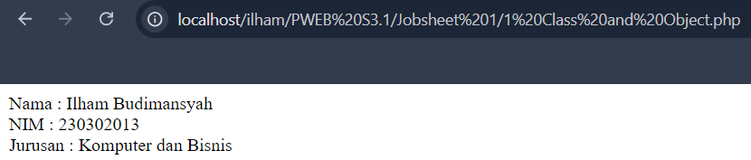
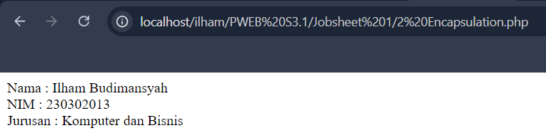
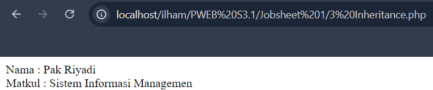
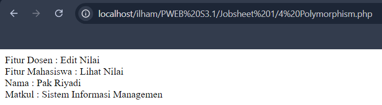

# DOKUMENTASI OOP
Pemrograman berorientasi objek (Inggris: object-oriented programming disingkat OOP) merupakan paradigma pemrograman berdasarkan konsep "objek", yang dapat berisi data, dalam bentuk field atau dikenal juga sebagai atribut; serta kode, dalam bentuk fungsi/prosedur atau dikenal juga sebagai method. Semua data dan fungsi di dalam paradigma ini dibungkus dalam kelas-kelas atau objek-objek. Bandingkan dengan logika pemrograman terstruktur. Setiap objek dapat menerima pesan, memproses data, dan mengirim pesan ke objek lainnya

## Class and Object
```php
<?php
// Definisi Class Mahasiswa
class Mahasiswa {
    // Atribut atau Properties
    // Atribut ini bersifat public sehingga dapat diakses dari luar kelas
    public $nama;
    public $nim;
    public $jurusan;

    // Constructor
    // Konstruktor ini digunakan untuk menginisialisasi objek dengan nilai awal untuk nama, nim, dan jurusan
    public function __construct($nama, $nim, $jurusan) {
        // Mengatur nilai properti berdasarkan parameter yang diterima
        $this->nama = $nama;
        $this->nim = $nim;
        $this->jurusan = $jurusan;
    }

    // Metode atau Function
    // Metode ini menampilkan data mahasiswa dalam bentuk string
    public function tampilkanData(){
        // Mengembalikan string yang berisi informasi nama, nim, dan jurusan mahasiswa
        return "Nama : $this->nama <br> NIM : $this->nim <br> Jurusan : $this->jurusan";
    }
}

// Instansiasi Objek
// Membuat objek baru dari kelas Mahasiswa dan memberikan nilai awal untuk nama, nim, dan jurusan
$mhs1 = new Mahasiswa("Ilham Budimansyah", "230302013", "Komputer dan Bisnis");

// Memanggil metode tampilkanData untuk menampilkan data mahasiswa dan mencetaknya ke layar
echo $mhs1->tampilkanData();
?>
```

## Encapsulation
```php
<?php
// Mendefinisikan kelas Mahasiswa
class Mahasiswa {
    // Properti bersifat private sehingga hanya dapat diakses dari dalam kelas
    private $nama;
    private $nim;
    private $jurusan;

    // Konstruktor kelas yang digunakan untuk menginisialisasi properti ketika objek dibuat
    public function __construct($nama, $nim, $jurusan) {
        // Menginisialisasi properti nama, nim, dan jurusan dengan nilai yang diberikan saat objek dibuat
        $this->nama = $nama;
        $this->nim = $nim;
        $this->jurusan = $jurusan;
    }

    // Getter untuk properti nama, mengembalikan nilai nama yang diawali dengan teks "Nama : "
    public function getNama() {
        return "Nama : " . $this->nama;
    }

    // Getter untuk properti nim, mengembalikan nilai nim yang diawali dengan teks "NIM : "
    public function getNim() {
        return "NIM : " . $this->nim;
    }

    // Getter untuk properti jurusan, mengembalikan nilai jurusan yang diawali dengan teks "Jurusan : "
    public function getJurusan() {
        return "Jurusan : " . $this->jurusan;
    }

    // Setter untuk mengubah nilai properti nama
    public function setNama($nama) {
        $this->nama = $nama;
    }

    // Setter untuk mengubah nilai properti nim
    public function setNim($nim) {
        $this->nim = $nim;
    }

    // Setter untuk mengubah nilai properti jurusan
    public function setJurusan($jurusan) {
        $this->jurusan = $jurusan;
    }
}

// Membuat objek baru dari kelas Mahasiswa dengan nilai awal untuk nama, nim, dan jurusan
$mhs1 = new Mahasiswa("Ilham Budimansyah", "230302013", "Komputer dan Bisnis");

// Menampilkan nama mahasiswa dengan memanggil metode getNama()
echo $mhs1->getNama(). "<br>";

// Menampilkan nim mahasiswa dengan memanggil metode getNim()
echo $mhs1->getNim(). "<br>";

// Menampilkan jurusan mahasiswa dengan memanggil metode getJurusan()
echo $mhs1->getJurusan();
?>
```


## Inheritance
```php
<?php

// Definisi Kelas Pengguna
class Pengguna 
{
    // Atribut protected, hanya bisa diakses oleh kelas ini dan kelas turunannya
    protected $nama;
    
    // Konstruktor
    // Konstruktor ini digunakan untuk menginisialisasi atribut nama
    public function __construct($nama)
    {
        $this->nama = $nama;
    }
    
    // Metode protected untuk mengambil nilai nama
    // Hanya bisa diakses dari dalam kelas ini atau dari kelas turunan
    protected function getNama() 
    {
        return $this->nama;
    }
}

// Definisi Kelas Dosen yang merupakan turunan dari kelas Pengguna
class Dosen extends Pengguna
{
    // Atribut private, hanya bisa diakses oleh kelas ini
    private $matkul;

    // Konstruktor
    // Konstruktor ini digunakan untuk menginisialisasi atribut nama dan matkul
    public function __construct($nama, $matkul)
    {
        // Mengatur nilai atribut matkul
        $this->matkul = $matkul;

        // Mengatur nilai atribut nama dengan memanggil konstruktor kelas induk
        // atau langsung menetapkannya dalam konstruktor ini
        $this->nama = $nama;
    }

    // Metode public untuk menampilkan informasi dosen
    public function getDosen()
    {
        // Mengembalikan string yang berisi nama dosen dan mata kuliah yang diampu
        return "Nama : " . $this->nama . "<br> Matkul : " . $this->matkul;
    }
}

// Instansiasi objek dari kelas Dosen
// Objek ini mewakili seorang dosen dengan nama "Pak Riyadi" dan mata kuliah "Sistem Informasi Managemen"
$dosen = new Dosen("Pak Riyadi", "Sistem Informasi Managemen");

// Memanggil metode getDosen untuk menampilkan informasi dosen
echo $dosen->getDosen();
?>
```



## Polymorphism
```php

<?php

// Definisi Kelas Pengguna
class Pengguna
{
    // Atribut protected, hanya dapat diakses oleh kelas ini dan kelas turunan
    protected $nama;

    // Konstruktor untuk menginisialisasi atribut nama
    public function __construct($nama)
    {
        $this->nama = $nama;
    }

    // Metode untuk mendapatkan nilai nama
    public function getNama()
    {
        return $this->nama;
    }

    // Metode untuk mengakses fitur, dapat di-overridden oleh kelas turunan
    public function aksesFitur()
    {
        return "Mengakses Fitur";
    }
}

// Definisi Kelas Dosen yang merupakan turunan dari kelas Pengguna
class Dosen extends Pengguna
{
    // Atribut private, hanya dapat diakses oleh kelas ini
    private $matkul;

    // Konstruktor untuk menginisialisasi atribut matkul dan nama
    // Konstruktor kelas induk dipanggil dengan parent::__construct($nama)
    public function __construct($nama, $matkul)
    {
        // Memanggil konstruktor kelas induk untuk menginisialisasi atribut nama
        parent::__construct($nama);
        // Menginisialisasi atribut matkul
        $this->matkul = $matkul;
    }

    // Override metode aksesFitur untuk memberikan fungsionalitas khusus bagi Dosen
    public function aksesFitur()
    {
        return "Edit Nilai";
    }

    // Metode untuk mendapatkan informasi dosen, termasuk nama dan mata kuliah yang diampu
    public function getDosen()
    {
        return "<br>Nama : " . $this->nama . "<br> Matkul : " . $this->matkul;
    }
}

// Definisi Kelas Mahasiswa yang merupakan turunan dari kelas Pengguna
class Mahasiswa extends Pengguna
{
    // Konstruktor untuk menginisialisasi atribut nama
    // Konstruktor kelas induk dipanggil dengan parent::__construct($nama)
    public function __construct($nama)
    {
        // Memanggil konstruktor kelas induk untuk menginisialisasi atribut nama
        parent::__construct($nama);
    }

    // Override metode aksesFitur untuk memberikan fungsionalitas khusus bagi Mahasiswa
    public function aksesFitur()
    {
        return "Lihat Nilai";
    }
}

// Instansiasi objek dari kelas Dosen
$dosen = new Dosen("Pak Riyadi", "Sistem Informasi Managemen");

// Memanggil metode aksesFitur untuk objek dosen dan mencetak hasilnya
echo "Fitur Dosen : " . $dosen->aksesFitur();

// Instansiasi objek dari kelas Mahasiswa
$mhs = new Mahasiswa("Ilham");

// Memanggil metode aksesFitur untuk objek mahasiswa dan mencetak hasilnya
echo "<br>Fitur Mahasiswa : " . $mhs->aksesFitur();

// Memanggil metode getDosen untuk mendapatkan informasi dosen dan mencetak hasilnya
echo $dosen->getDosen();
?>
```



## Abstraction
```php
<?php
// Definisi Class
abstract class Pengguna
{
    // Atribut atau Properties
    // Properti protected dapat diakses dari kelas ini dan kelas turunan
    protected $nama;

    // Constructor
    public function __construct()
    {
        // Konstruktor ini kosong, tetapi tetap didefinisikan untuk memungkinkan inisialisasi
    }

    // Metode atau Function
    // Metode ini digunakan untuk menetapkan nilai properti nama
    public function setNama($nama)
    {
        $this->nama = $nama;
    }

    // Metode atau Function    
    // Metode ini digunakan untuk mengambil nilai properti nama
    public function getNama()
    {
        return $this->nama;
    }

    // Deklarasi metode abstrak
    // Metode ini wajib diimplementasikan oleh kelas turunan
    abstract public function aksesFitur();
}

// Definisi Class Dosen yang merupakan turunan dari kelas Pengguna
class Dosen extends Pengguna
{
    // Constructor
    public function __construct()
    {
        // Memanggil konstruktor kelas induk, meskipun kosong, menjaga kemungkinan ekspansi di masa depan
        parent::__construct();
    }

    // Implementasi metode abstrak aksesFitur
    // Menampilkan nama dosen dan fitur yang dapat diakses oleh dosen
    public function aksesFitur()
    {
        echo $this->getNama() . ": fitur input nilai mahasiswa <br>";
    }
}

// Definisi Class Mahasiswa yang merupakan turunan dari kelas Pengguna
class Mahasiswa extends Pengguna
{
    // Constructor
    public function __construct()
    {
        // Memanggil konstruktor kelas induk, meskipun kosong
        parent::__construct();
    }

    // Implementasi metode abstrak aksesFitur
    // Menampilkan nama mahasiswa dan fitur yang dapat diakses oleh mahasiswa
    public function aksesFitur()
    {
        echo $this->getNama() . ": fitur lihat nilai <br>";
    }
}

// Pembuatan objek dari kelas Dosen
$dosen = new Dosen();
// Menetapkan nama untuk objek dosen
$dosen->setNama("Pak Riyadi");

// Pembuatan objek dari kelas Mahasiswa
$mhs = new Mahasiswa();
// Menetapkan nama untuk objek mahasiswa
$mhs->setNama("Ilham");

// Memanggil metode aksesFitur pada objek dosen
$dosen->aksesFitur();

// Memanggil metode aksesFitur pada objek mahasiswa
$mhs->aksesFitur();
?>
```


